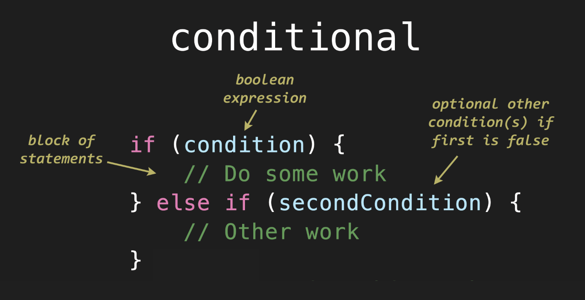

# Unit 3 - Conditionals and Loops

## 3.2 - Else-If

##### ICS3 - Mr. Brash 🐿️

<table>
<tr>
<th>
In this Lesson:
</th>
<th>
Unit 3 - Conditionals & Loops
</th>
</tr>
<tr>
<td td valign="top" style="height: 100px;padding-right:50px">
<ul>
<li><a href="#lesson">Else-If Syntax</a></li>
<li><a href="#examples">Examples</a></li>

<li><a href="">Practice Time!</a></li>
<ul>
<li><a href="#part-1">Part 1</a></li>
<li><a href="#part-2">Part 2</a></li>
<li><a href="#part-3">Part 3</a></li>
<li><a href="#part-4">Part 4</a></li>
</ul>
</ul>
</td>
<td td valign="top" style="height: 100px;padding-right:50px">
<ul>
<li><a href="../../README.md">README</a></li>
<li><a href="./1 - If.md">3.1 - If</a></li>
<li><a href="./2 - Else-If.md">3.2 - Else-If</a></li>
<li><a href="./3 - Else.md">3.3 - Else</a></li>
<li><a href="../2 - Loops/4 - While.md">3.4 - While</a></li>
<li><a href="../2 - Loops/5 - Do-While.md">3.5 - Do...While</a></li>
<li><a href="../2 - Loops/6 - For.md">3.6 - For</a></li>
<ul>

</td>


</tr>
</table>

---

### Lesson:

The `if-statement` allows us to make decisions with code:
```JS
if (age >= 60) {
    console.log("You old!")
}
```

**But what if we needed to make *several* decisions based on fairly complex conditions?**

For example - the user selects a colour based on a number:
```JS
let selection = prompt("Enter 1 for red, 2 for blue, 3 for green, 4 for purple")

if (selection == 1) {
    // Do something
}

if (selection == 2) {
    // Do something else
}

if (selection == 3) {
    // Do something else
}

if (selection == 4) {
    // Do something else
}
```

In the above example, the code is going to check the variable `selection` FOUR times, even if the user entered "1" or a number not in the list, like "8". *That's a lot of wasted checking.*


<div style="text-align:center;"><p>The <code>if-statement</code> has another optional piece that will help with this scenario.</p></div>

The `else if` block will *only* be checked if the condition above it was `false`.<br>Let's retry our colour selection example:
```JS
let selection = prompt("Enter 1 for red, 2 for blue, 3 for green, 4 for purple")

if (selection == 1) {
    // Do something
} else if (selection == 2) {
    // Do something else
} else if (selection == 3) {
    // Do something else
} else if (selection == 4) {
    // Do something else
} else {
    // for all other cases, do this
}
```
Notice in the code above, if the user enters "2", the code will check if it's equal to 1 (it's not), then check if it's equalt to 2 (it is) and it will NOT check any of the other conditions - it will run the block of code for `== 2`.

Also notice the final `else` statement. **What if the user enters 99?** The `else` block catches all other scenarios (anything that wasn't caught within the conditions).

**Note:**
- You can have as many `else if` statements as you need but only *one* `if`.
- You can only have *one* `else` statement. It is *optional* and it must be *last*.

### Final Notes:

- To get the **_length_ of a String**, we can use `.length`<br>For Example:<br>
  ```JS
  let name = "Mr. Squirrel"
  console.log("Your name is", name.length, "characters long.")
  ```
- The internet is full of [tutorials](https://javascript.info/ifelse), [more tutorials](https://www.w3schools.com/js/js_if_else.asp), and [examples](https://www.google.com/search?q=if+else+statement+example) about the if-else statement since it is one of the very first constructs people learn in programming.


🐿️

